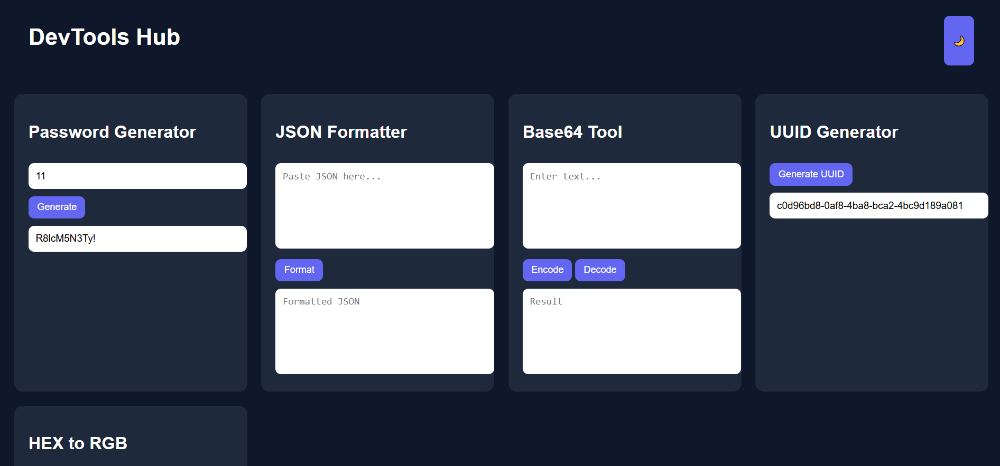

🚀 DevTools Hub – All-in-One Developer Toolbox

A modern, lightweight developer utility dashboard built with pure HTML, CSS, and JavaScript.
Includes essential tools like JSON Formatter, Password Generator, Base64 Encoder/Decoder, UUID Generator, and Color Converter — all in one place.

🌐 Live Demo

https://yourusername.github.io/devtools-hub/

✨ Features

🔐 Password Generator (Custom Length)

🧾 JSON Formatter & Beautifier

🔡 Base64 Encoder / Decoder

🆔 UUID Generator (crypto API)

🎨 HEX to RGB Color Converter

🌙 Dark / Light Mode Toggle

📱 Fully Responsive Design

⚡ Fast & Lightweight

🔥 100% Open Source

📸 Preview

(Optional but highly recommended for stars ⭐)

📂 Project Structure
devtools-hub/
│
├── index.html
├── css/
│ └── style.css
├── js/
│ └── script.js
└── README.md

🛠 Built With

HTML5

CSS3 (Grid, Flexbox, CSS Variables)

Vanilla JavaScript (ES6+)

Web APIs (crypto, local DOM methods)

No frameworks. No dependencies. Pure frontend.

🚀 How To Use

1️⃣ Clone the repository

git clone https://github.com/Haseeb-MernStack/devtools-hub.git

2️⃣ Open the folder

cd devtools-hub

3️⃣ Open index.html in your browser

That’s it 🎉

🧠 Tool Descriptions
🔐 Password Generator

Generates secure random passwords using a mix of characters.

🧾 JSON Formatter

Validates and formats JSON with proper indentation.

🔡 Base64 Tool

Encode or decode text using Base64.

🆔 UUID Generator

Creates unique IDs using the browser’s crypto.randomUUID() API.

🎨 Color Converter

Converts HEX color codes to RGB values instantly.

📱 Responsive Design

Optimized for:

Desktop

Tablet

Mobile

Large Screens

Clean developer-focused UI.

🎯 Customization

You can easily:

Change theme colors → :root variables in style.css

Add new tools → Extend script.js

Improve UI → Modify CSS

Add animations → Enhance UX

🚀 Future Improvements (Roadmap)

📋 Copy-to-Clipboard Buttons

🔍 Regex Tester

🔑 JWT Decoder

📝 Markdown Previewer

📦 Minifier (HTML/CSS/JS)

🔄 Drag & Reorder Tools

📱 PWA Support (Installable App)

🤝 Contributing

Contributions are welcome!

Fork the repository

Create a new branch

Submit a Pull Request

⭐ Support

If this project helped you:

⭐ Star the repository

🍴 Fork it

📢 Share it with other developers

📄 License

This project is licensed under the MIT License.
Free for personal and commercial use.

👨‍💻 Author

Built with ❤️ by Haseeb MernStack

GitHub: https://github.com/Haseeb-MernStack

YouTube: https://youtube.com/@haseebmernstack
